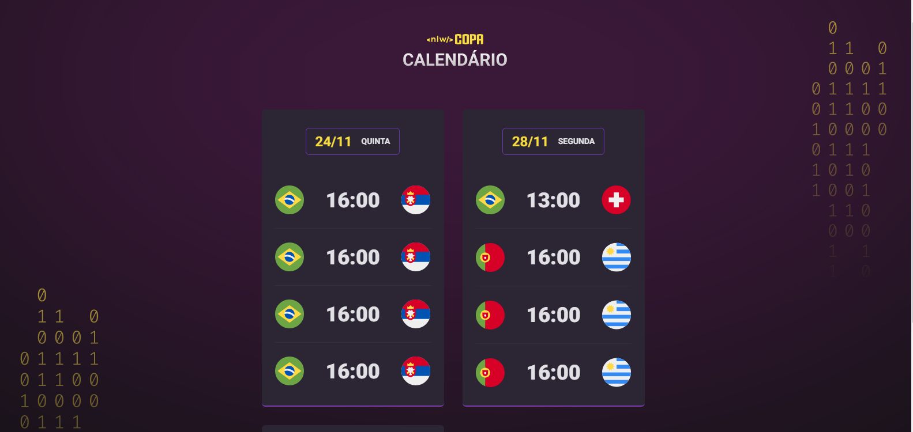

<h1 align="center"> 
CALENDÁRIO DA COPA - NLW</h1>

[Visite a página](https://danieli01.github.io/copa-nlw-22/)

Evento exclusivo e gratuito, promovido pela Rocketseat para ensino de tecnologias WEB.

  <a href="#-tecnologias">Tecnologias</a>&nbsp;&nbsp;&nbsp;|&nbsp;&nbsp;&nbsp;
  <a href="#-projeto">Projeto</a>&nbsp;&nbsp;&nbsp;|&nbsp;&nbsp;&nbsp;
  <a href="#-layout">Layout</a>&nbsp;&nbsp;&nbsp;|&nbsp;&nbsp;&nbsp;
  <a href="#memo-licença">Licença</a>

  

 

  

## 🚀 Tecnologias

Esse projeto foi desenvolvido com as seguintes tecnologias:

- HTML e CSS
- JavaScript 
- [Git e GitHub](https://github.com/Danieli01/copa-nlw-22)
- Figma

## 💻 Projeto

O Calendário é um componente que simula o formulário de preenchimento de cartão de crédito, onde é possível adicionar máscara aos inputs e atualizar elementos HTML via DOM.

## :memo: Licença

Esse projeto está sob a licença MIT.

---

Feito com ♥ by Rocketseat :wave: [Participe da nossa comunidade!](https://discord.gg/rocketseat)